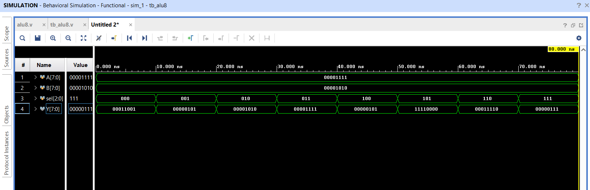
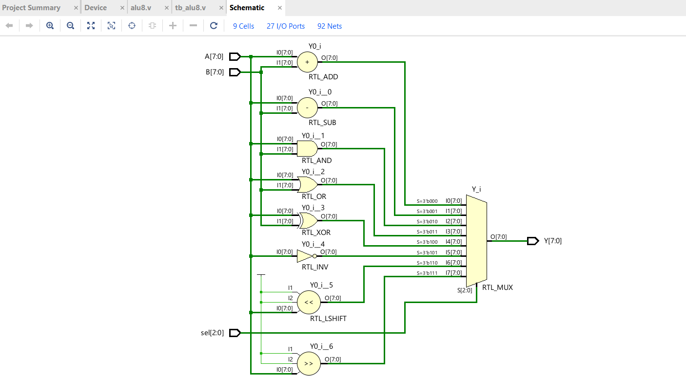

# 8-bit ALU in Verilog

This project creates an **8-bit ALU (Arithmetic Logic Unit)** using Verilog.  
Think of it like a small calculator that can perform different operations on two 8-bit numbers.

## Features
- Two **8-bit inputs**: `A` and `B` (the numbers to calculate with)  
- One **3-bit select input**: `sel` (chooses which operation to perform)  
- **Supported operations**:  
  - ADD (A + B)  
  - SUB (A - B)  
  - AND (bitwise AND of A and B)  
  - OR (bitwise OR of A and B)  
  - XOR (bitwise XOR of A and B)  
  - NOT A (invert all bits of A)  
  - Shift Left (move bits of A one step left)  
  - Shift Right (move bits of A one step right)  

## Simulation
- Tested with **behavioral simulation** in Xilinx Vivado  
- **** shows ALU outputs changing with `sel`  
- **** shows the ALU block diagram with inputs and output  

## How to Run
1. Open **Vivado**  
2. Add the **ALU code**: `alu8.v`  
3. Add the **testbench**: `tb_alu8.v`  
4. Run **behavioral simulation**  
5. Check the **waveform** to verify ALU outputs
